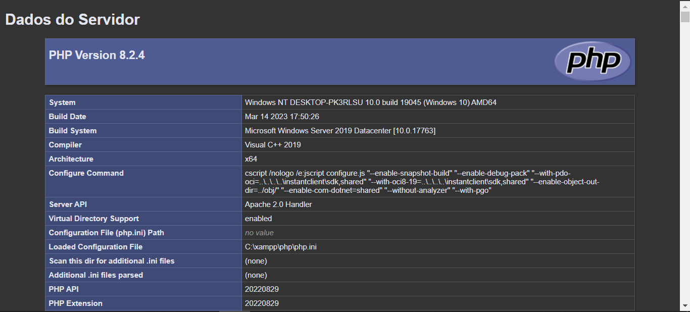

# DADOS DO SERVIDOR
👨‍🏫PROJETO CRIADO PARA O CURSO DE PHP DO CURSO EM VIDEO.

  

## DESCRIÇÃO:
O "Dados do Servidor" exibe informações detalhadas sobre a configuração do servidor PHP. Ela utiliza a função `phpinfo()` para gerar uma página HTML contendo todas as informações relevantes sobre a versão do PHP, configurações do servidor, módulos habilitados, variáveis do ambiente, entre outros detalhes.

## EXECUTANDO O PROJETO:
1. **Executando o Aplicativo:**
   - Coloque os arquivos em um servidor web compatível com PHP (por exemplo, XAMPP, WAMP, LAMP).
   - Acesse o formulário no navegador visitando `http://localhost/CODIGO/index.php`.

2. **Como usar?**
   1. **Visualizar as Informações do Servidor:**
      - Após acessar a página `index.php` pelo navegador, você verá uma lista extensa de informações detalhadas sobre o servidor PHP.
      - Essas informações incluem a versão do PHP, configurações do servidor, módulos carregados, variáveis de ambiente, entre outros detalhes relevantes.

   2. **Analisar as Informações:**
      - Você pode usar essas informações para verificar a configuração do seu servidor PHP, identificar módulos habilitados, conferir variáveis de ambiente e muito mais.
      - Esses detalhes são úteis para fins de depuração, otimização e solução de problemas em aplicações web baseadas em PHP.
      
## CREDITOS:
- [PROJETO CRIADO PARA O CURSO DE PHP](https://github.com/VILHALVA/CURSO-DE-PHP)
- [PROJETO FEITO PELO VILHALVA](https://github.com/VILHALVA)

